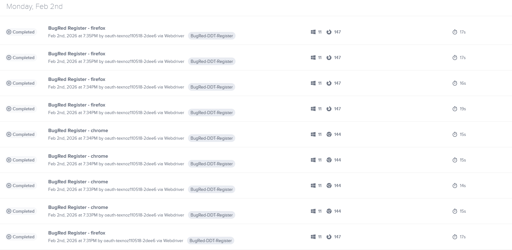

# Assignment 6 - DDT and cloud-based cross-browser testing

## About
Solution to test users.bugtest.ru platform's registration form

## Run Tests
To run tests you need to run testng.xml

## Test System

http://users.bugred.ru/user/login/index.html

## Screenshot of dashboard of test results

## Test cases

| Test case ID | Name     | email          | password | expected result |
|--------------|----------|----------------|-------|-----------------|
| TC-01        | Rusya022 | rssya3@mail.ru | 123   | OK              |
| TC-02        | Rusya02  | rsxya          | 123   | BAD_EMAIL       |
| TC-03        | Rusya022 | rszya@mail.ru  | 123   | BUSY_NAME       |
| TC-04        | Rusya045 | rssya3@mail.ru | 123   | BUSY_EMAIL      |/ 
## Test Description
1. Testing of a registration form
2. Test steps: 
   * Enter credentials
   * Click button of registration
3. Test data is given in Test cases
4. Expected Results are given in Test cases

